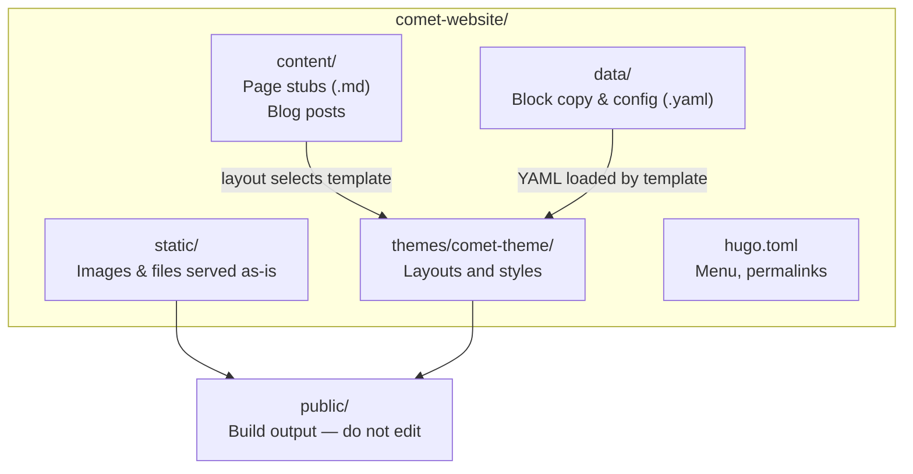

# Content editor's guide

Practical reference for editing the COMET Hugo site. Assumes basic familiarity with Git, YAML, and Markdown.

**Live site:** https://www.cometdata.org/

---

## Table of contents

1. [Quick reference](#quick-reference)
2. [Common tasks](#common-tasks)
3. [How content is stored](#how-content-is-stored)
4. [YAML pitfalls](#yaml-pitfalls)
5. [Block types and the block gallery](#block-types-and-the-block-gallery)
6. [Blog posts](#blog-posts)
7. [Media files](#media-files)
8. [Join Us form](#join-us-form)
9. [Publishing and deployment](#publishing-and-deployment)
10. [Local preview](#local-preview)
11. [Git workflow](#git-workflow)
12. [Accessibility for content editors](#accessibility-for-content-editors)
13. [Appendix: file lookup](#appendix-file-lookup)

---

## Quick reference

| Item | Detail |
|---|---|
| **Production URL** | https://www.cometdata.org/ |
| **What triggers a deploy** | Merging (or pushing) to the `main` branch |
| **Where to watch deploys** | GitHub → **Actions** tab → **GitHub Pages** workflow |
| **Typical deploy time** | A few minutes after the workflow starts; refresh the live site when the run shows a green checkmark |
| **Block gallery (internal)** | `/test-page/` — live examples of every block; not in the menu; not indexed |
| **Primary editing surface** | YAML in `data/` for page blocks; Markdown in `content/posts/` for blog articles |
| **Every page needs** | A `.md` file in `content/` (see below) |

### Where to edit what

| I want to change… | Edit this |
|---|---|
| Homepage hero | `data/home/hero.yaml` |
| Homepage body sections | Other files in `data/home/` |
| About page copy | `data/about/*.yaml` |
| Projects list | `data/projects/stacked_cards.yaml` |
| Community organisers / advisors | `data/community/stacked_cards_organisers.yaml`, `stacked_cards_advisors.yaml` |
| Footer address or social links | `data/footer/address_text.yaml`, `data/footer/socials.yaml` |
| Join Us form copy | `data/join_us/form.yaml`, `data/join_us/hero.yaml` |
| Thank-you page | `data/join_us/thank_you.yaml` (hero is shared with Join Us) |
| Blog post | `content/posts/{slug}.md` + images in `static/images/blog/{slug}/` |
| Image alt text / accessibility | See [Accessibility for content editors](#accessibility-for-content-editors); `media_alt` in YAML |
| Site menu labels / order | `hugo.toml` → `[menu]` section |
| Page URL or layout | Matching file in `content/` (e.g. `content/about.md`) |

Data folders use **underscores** (`join_us`, `comet_model`); public URLs use **hyphens** (`/join-us/`, `/comet-model/`).

---

## Common tasks

### Update the homepage hero

1. Open `data/home/hero.yaml`.
2. Edit `headline`, `content`, and optionally `media`, `media_alt`, `media_hover`.
3. Preview locally (see [Local preview](#local-preview)) or wait for deploy after merge to `main`.

### Change About page copy

1. Identify the section — files in `data/about/` map to blocks on the page (hero, three text-media bands, stacked cards).
2. Edit the relevant YAML file. Text fields support Markdown (links, emphasis, lists).
3. Preview `/about/`.

### Add or edit a blog post

See [Blog posts](#blog-posts) for the full workflow.

### Update footer or social links

1. `data/footer/address_text.yaml` — postal address and contact lines.
2. `data/footer/socials.yaml` — social network links and icons.

### Change impact numbers on the homepage

Edit `data/home/impact_band.yaml` — the metrics table is Markdown inside the `table` field.

### Edit Join Us or thank-you copy

| Content | File |
|---|---|
| Hero (shared by both pages) | `data/join_us/hero.yaml` |
| Intro above the form | `data/join_us/form.yaml` → `content` |
| Participation options | `data/join_us/form.yaml` → `participation.options` |
| Additional notes label | `data/join_us/form.yaml` → `additional_notes.label` |
| Thank-you message | `data/join_us/thank_you.yaml` |

**Note:** Join Us and thank-you share the same hero YAML. Changing the hero affects both URLs.

---

## How content is stored

### The `.md` file is required for every page

Hugo needs a Markdown file in `content/` to register a page and assign its URL. Even when all visible copy lives in YAML, the `.md` stub must exist.

Typical block-driven page stub:

```toml
+++
title = "About"
date = "2019-03-26T08:47:11+01:00"
draft = false
layout = "about"
+++
```

The `layout` value selects which page template runs; that template loads YAML from `data/{section}/`.

### YAML holds most visible copy

Marketing pages (home, about, projects, community, join-us, etc.) store headlines, body text, images, and CTAs in **`data/{section}/*.yaml`**, not in the `.md` body. Each YAML file maps to one **block** on the page.

### Exceptions and discrepancies

| Case | Where content lives | Notes |
|---|---|---|
| **Blog posts** | `content/posts/*.md` body + front matter | Full article text is Markdown in the `.md` file; not in `data/` |
| **Block-driven pages** | `data/{section}/*.yaml` | `.md` body is usually empty |
| **Thank-you page** | `data/join_us/thank_you.yaml` | Uses layout `join-us-thank-you`; hero comes from shared `data/join_us/hero.yaml` |
| **Footer** | `data/footer/*.yaml` | No dedicated page stub — loaded globally by the theme |
| **Blog index hero** | `data/blog/hero.yaml` | Page stub is `content/posts/_index.md` |
| **Internal test page** | `data/testing/*.yaml` | `content/test-page.md`; not linked in navigation |

### Site structure on disk



| Directory | Editor touch? |
|---|---|
| `content/` | **Yes** — page stubs and blog posts |
| `data/` | **Yes** — primary editing surface for blocks |
| `static/images/` | **Yes** — upload and reference images |
| `themes/comet-theme/` | Rarely — layout or styling changes need a developer |
| `public/` | **Never** — generated by the build; changes are overwritten |
| `hugo.toml` | Occasionally — menu, permalinks |

---

## YAML pitfalls

YAML is indentation-sensitive. These issues cause silent wrong output or build failures.

### Indentation

Use **spaces only** (two spaces per level). Tabs will break the file.

```yaml
elements:
  - title: "First item"
    content: "Nested under the list item"
```

### Multi-line text

Use `|` for paragraphs that span multiple lines:

```yaml
content: |
  First paragraph.

  Second paragraph with a [link](/about).
```

Without `|`, a line break in YAML can concatenate or truncate unexpectedly.

### Quoting

Quote values that contain `:`, `#`, or leading special characters:

```yaml
headline: "Research Type: an overview"
```

### Image paths

Always root-relative, starting with `/images/`:

```yaml
media: "/images/about/spiderweb.jpg"
```

Files live under `static/images/` on disk; Hugo serves them at `/images/`.

### Tables in YAML

Impact-band and stacked-card tables are Markdown strings, often wrapped in quotes:

```yaml
table: "
| Column | Value |
| ------ | ----- |
| Row    | 123   |
"
```

Keep the pipe characters aligned; a missing `|` breaks the table.

### Do not edit `public/`

The `public/` folder is rebuilt on every deploy. Edit source files in `content/`, `data/`, or `static/` instead.

### Validate before committing

Preview locally after YAML edits. If the build fails, Hugo usually reports the file and line number.

---

## Block types and the block gallery

The live site uses a fixed **block library** (hero, text-media bands, impact band, stacked cards, diagram, forms, featured post). Each block is one YAML file plus a theme template.

**See every block live:** https://www.cometdata.org/test-page/

The block gallery (`/test-page/`) shows one example of each block type and all supported colour variants. It is excluded from the site menu and search indexing (`noindex` + sitemap disabled). Use it when choosing variants for new copy.

| Block | Purpose | Key variants |
|---|---|---|
| **hero-intro** | Page hero | `background`, `media-right`, `media-left`; `with-cta` and `with-bullets` exist but are not fully implemented yet |
| **text-media-band** | Two-column narrative | `image-left`, `image-right`, `text-only`, `cta-only` |
| **impact-band** | Metrics table + intro | Default; `color: "alt"`; optional CTA; `variant: "below"` |
| **stacked-cards** | Timelines, principles, projects, people | `layout_variant`: `three`, `stack`, `grid`; `color_variant`: (default dark blue), `gold`, `white`, `light-green` |
| **diagram-stage** | Multi-image carousel with animated line | `mediaPrimary`, `mediaSecondary`, `mediaPrimaryMobile`, `mediaSecondaryMobile`; auto-crossfade between images |
| **comet-model-diagram-v1** | Model page diagram | Used on `/comet-model/` |
| **form-stack** | Join Us signup form | Live form at `/join-us/`; demo (non-submitting) on test page |
| **form-stack-text** | Thank-you / confirmation message | `/thank-you/` |
| **featured-post** | Highlighted blog card | Set `featured = true` on one post |

Decorative **comet-line** elements are included automatically by other blocks — not configured in YAML.

---

## Blog posts

### Create a new post

1. Add `content/posts/my-post-slug.md` with front matter and body.
2. Add images to `static/images/blog/my-post-slug/`.
3. Set `draft = false` when ready to publish.
4. Preview at `/blog/my-post-slug/` locally.

Use a **descriptive `title`** (it becomes the featured-image alt text on listings). For images in the body, use Markdown `` — see [Accessibility for content editors](#accessibility-for-content-editors).

### Front matter example

```toml
+++
date = '2025-03-14T09:30:43Z'
draft = false
title = "Participant Perspectives | Cristina Huidiu"
slug = "participant-perspectives-cristina-huidiu"
authors = ["Clare Dean"]
categories = ["Community Perspectives"]
tags = ["community", "metadata"]
media = "/images/blog/participant-perspectives-cristina-huidiu/featured-screenshot.png"
+++
```

### Excerpt vs full body

Text **above** `<!--more-->` appears in blog listings. Everything **below** is the full article:

```markdown
Intro paragraph shown in listings.

<!--more-->

Full article body in Markdown below the fold.
```

### Featured post on the blog index

Add `featured = true` to **one** post's front matter. That post renders in the large featured card at the top of `/posts/`. Only one post should be featured at a time.

### URLs and taxonomies

- Published URLs: `/blog/{slug}/` (configured in `hugo.toml`).
- `categories` and `tags` power the blog filter dropdowns.
- `authors` is a separate taxonomy for the author filter.

### Drafts

Set `draft = true` to hide a post from production builds. Preview drafts locally with `hugo server -D` or `./scripts/dev-server.sh` (pass `-D` if needed).

---

## Media files

### Where to put images

All site images go in **`static/images/`**, referenced as `/images/...` in YAML or front matter.

| Subfolder | Typical use |
|---|---|
| `static/images/home/` | Homepage |
| `static/images/about/` | About page |
| `static/images/community/` | Community; `people/` and `advisors/` for portraits |
| `static/images/join-us/` | Join Us hero |
| `static/images/projects/` | Projects page |
| `static/images/comet-model/` | Model diagram |
| `static/images/blog/{post-slug}/` | One folder per blog post |
| `static/images/icons/` | Small SVG icons |
| `static/images/logos/` | COMET logos |

### Image guidelines

| Use | Dimensions (approx.) | Format |
|---|---|---|
| Hero / text-media photos | 1200–1600 px wide | JPEG or WebP, quality 75–85 |
| Blog featured images | 1200 × 675 px (16:9) | JPEG or WebP |
| Portraits | 400–600 px square | JPEG |
| Logos | Max 400 px wide | PNG or SVG |
| Diagrams | As authored | SVG preferred |

Always set **`media_alt`** when you add or change an image in YAML. See [Accessibility for content editors](#accessibility-for-content-editors) for alt-text guidance, link wording, and a pre-publish checklist.

---

## Join Us form

The form at `/join-us/` posts directly to Mailchimp. No API key is stored in the repo.

### What editors can change

| Content | File |
|---|---|
| Page hero | `data/join_us/hero.yaml` (shared with thank-you) |
| Intro above the form | `data/join_us/form.yaml` → `content` |
| Participation options | `data/join_us/form.yaml` → `participation.options` |
| Additional notes label | `data/join_us/form.yaml` → `additional_notes.label` |
| Thank-you copy | `data/join_us/thank_you.yaml` |

### What needs developer help

| Item | Notes |
|---|---|
| Mailchimp endpoint IDs | `data/join_us/form.yaml` → `mailchimp.*` |
| Merge tag mapping | Must match Mailchimp audience field names exactly |
| Form template / validation | Theme templates |
| Mailchimp redirect URL | Set in Mailchimp admin (Forms → Form builder → Signup thank you page). **Changing it affects all forms on that audience**, not just Join Us |

Production thank-you URL: `https://www.cometdata.org/thank-you/`

### Field mapping

| Form label | YAML key | Mailchimp name |
|---|---|---|
| Email | `email` | `EMAIL` |
| First name | `first_name` | `FNAME` |
| Surname | `last_name` | `LNAME` |
| Primary affiliation | `primary_affiliation` | `MMERGE9` |
| Secondary affiliation | `secondary_affiliation` | `MMERGE10` |
| LinkedIn | `linkedin` | `MMERGE11` |
| Areas of participation (comma-separated selections) | `participation_areas` | `MMERGE12` |
| Additional notes | `additional_notes` | `MMERGE13` |

Participation selections are submitted as a comma-separated list in `MMERGE12`. The additional notes field maps to `MMERGE13`. Both Mailchimp text merge fields are limited to **255 characters** — the form enforces this on the notes field and blocks over-length submissions.

---

## Publishing and deployment

### How deployment works

1. Changes merge into **`main`** (via pull request or direct push).
2. GitHub Actions runs the **GitHub Pages** workflow (`.github/workflows/hugo.yml`).
3. The workflow installs Hugo, runs a production build, and publishes the `public/` output to GitHub Pages.
4. The live site updates at https://www.cometdata.org/ once the workflow completes.

### Checking deploy status

1. Open the repository on GitHub.
2. Go to the **Actions** tab.
3. Click the latest **GitHub Pages** run for your commit.
4. Wait for all steps to show green checkmarks (typically **2–5 minutes**).
5. Hard-refresh the live site to confirm changes.

Pull requests also trigger a build (for validation) but **only pushes to `main` deploy** to production.

### Editing via GitHub web UI

You can edit YAML or Markdown files directly on GitHub:

1. Navigate to the file → **Edit** (pencil icon).
2. Commit to a new branch.
3. Open a pull request into `main`.
4. Merge when ready — deploy starts automatically.

### Production URL

The site is served at the domain root: `https://www.cometdata.org/`. Internal links in YAML should stay root-relative (`/about/`, `/join-us/`) — Hugo resolves them correctly in production.

---

## Local preview

**Requirements:** [Hugo Extended](https://gohugo.io/installation/) and Dart Sass.

```bash
# Start dev server (recommended)
./scripts/dev-server.sh
```

Open http://127.0.0.1:1313/ and hard-refresh after changes.

**If CSS or styling breaks:**

```bash
pkill -f "hugo server"
./scripts/dev-rebuild.sh
./scripts/dev-server.sh
```

**Production build** (matches CI — stop the dev server first):

```bash
hugo --minify -b 'https://www.cometdata.org/'
```

Output goes to `public/`. Do not run a production build while the dev server is running.

Block gallery locally: http://127.0.0.1:1313/test-page/

---

## Git workflow

| Branch | Role |
|---|---|
| **`main`** | Production — merges deploy automatically |
| **`development`** | Optional integration branch |
| **`feature/*`** | Short-lived branches for a single change |

**Suggested workflow:**

1. Branch from `main`: `git checkout -b feature/my-edit`
2. Edit YAML, images, or posts; preview locally
3. Commit, push, open a pull request
4. Merge to `main` when reviewed — site deploys automatically

Avoid committing directly to `main` when review is desired.

---

## Accessibility for content editors

Accessible content helps everyone — including people using keyboards, screen readers, or zoom. Most of what visitors experience is **your copy and images** in `data/` and `content/posts/`. The theme adds site-wide navigation aids (skip link, focus styles, labelled menus, form labels on Join Us), but **editors still need to write good alt text, links, and headings**.

### Images and alt text

Alt text describes an image for people who cannot see it. Screen readers read it aloud; it also appears when an image fails to load.

**Rule of thumb:** If the image conveys information, add a short description. If it is purely decorative and the nearby text already says everything, leave alt empty — but only when the theme supports that explicitly (see below).

#### Block pages (`data/` YAML)

Many blocks pair a `media` path with **`media_alt`**. Always set both when you add or change a photo or diagram:

```yaml
media: "/images/home/dandelion.jpg"
media_hover: "Dandelion"
media_alt: "Dandelion seed head with seeds dispersing in the wind"
```

| Field | Purpose |
|---|---|
| `media` | Image path (`/images/...`) |
| `media_alt` | **Accessibility description** — required for informative images |
| `media_hover` | Optional tooltip on hover — **not** a substitute for `media_alt` |

**Blocks that use `media_alt` in YAML:**

| Block / file | Alt field | Editor action |
|---|---|---|
| **hero-intro** | `media_alt` | Set whenever `media` is set (homepage, about, community, join-us, blog index, etc.) |
| **text-media-band** | `media_alt` | Set for each band image |
| **comet-model-diagram-v1** | `media_alt` | Describe the diagram for someone who cannot see it |
| **diagram** (single SVG on model page) | `media_alt` | Same as above — see `data/the_comet_model/diagram.yaml` for a good example |

**Blocks where alt is derived from other fields** (keep those fields accurate):

| Block | How alt is built | Editor action |
|---|---|---|
| **stacked-cards — organisers** | Org logo: `link_text` (e.g. `"CDL"`); portraits: `name` | Use clear organisation names and full person names |
| **stacked-cards — advisors** | Portrait: `name` | Use full names; add role in `job_title` / `company` nearby |
| **stacked-cards — three-column** (e.g. homepage “Join the evolution”) | Icons currently have no alt in the theme | Write clear **`title`** text for each column — ask a developer if icons need explicit alt later |
| **diagram-stage** (multi-image carousel) | Alt not yet configurable in YAML | Describe key visuals in the block **`content`** until alt fields are added |

#### Blog posts (`content/posts/`)

| Image type | Where to set alt | Notes |
|---|---|---|
| **Featured / listing image** | Front matter `title` | The theme uses the post title as alt on cards and listings — write a descriptive title, not only a name |
| **Images in the article body** | Markdown syntax | `` |
| **Legacy Squarespace HTML** | `alt` attribute on `` | Many imported posts have `alt=""`. When you edit a post, replace broken HTML with clean Markdown, or add a meaningful `alt="..."` |

**Good alt examples for blog posts:**

```markdown


```

**Avoid:**

- `alt=""` on informative photos (portraits, charts, screenshots)
- `"image"`, `"photo"`, or `"screenshot"` alone
- Repeating the entire caption word-for-word if the caption sits right below the image — summarise instead

#### How to write useful alt text

| Do | Don't |
|---|---|
| Describe what matters for the surrounding content | List every visual detail |
| Mention people’s names in portrait alt when they are the subject | Use filenames (`IMG_0042.jpg`) as alt |
| For diagrams, summarise the idea (“Padlock opening to show shared stewardship”) | Say “diagram” with no explanation |
| Keep it to one or two short sentences | Paste the full paragraph next to the image |

**Decorative images** (pure ornament, no information): leave alt empty only when confirmed decorative. When in doubt, write brief alt text — it is rarely harmful.

When adding images, use **descriptive filenames** (`gold-padlock.jpg`, not `IMG_0042.jpg`) — this helps editors and developers find assets, even though filenames are not shown to visitors.

### Links and call-to-action text

Link text should make sense out of context — screen reader users often hear a list of links without surrounding prose.

| Prefer | Avoid |
|---|---|
| `Explore the COMET model` | `Click here` |
| `Read the enrichment projects announcement` | `More` |
| `Get in touch` (Join Us CTA) | `Link` |

In YAML, **`cta_text`**, **`cta_link_text`**, and Markdown links inside `content:` fields should follow the same rule.

External links in blocks (e.g. organiser websites) use visible button text like `CDL` — keep **`link_text`** meaningful.

### Headings

- Each public page gets **one main heading (`h1`)** from the hero block — you do not add another `h1` in YAML body text.
- In blog posts, the post **title** is the `h1`; start the body at **`##` (h2)** for major sections, then `###` for subsections.
- Do not skip levels (e.g. `h2` straight to `h4`) — it confuses outline navigation.

### Tables and data

Impact-band and stacked-card **tables** are Markdown inside YAML. Use a header row so columns are labelled. Do not rely on colour alone to convey meaning — include the status or value in text (e.g. “Active”, not only a green cell).

### Join Us form copy

Field labels in `data/join_us/form.yaml` must stay aligned with what the form asks for. If you rename a label or participation option, check that the question is still clear. Participation options are a simple list under `participation.options`.

Do not rename YAML keys that map to Mailchimp (`email`, `first_name`, etc.) without developer help — see [Join Us form](#join-us-form).

### Pre-publish checklist

Before merging content changes:

- [ ] Every **informative** image in YAML has **`media_alt`** (where the block supports it).
- [ ] Blog **titles** describe the post; inline images use **``** or fixed `alt` on ``.
- [ ] **Link text** is descriptive (`Explore the COMET model`, not `click here`).
- [ ] **Headings** follow a logical order (one `h1` per page; blog body starts at `h2`).
- [ ] **Tables** have header rows; critical info is not colour-only.
- [ ] **Org / person names** in stacked-cards grids are spelled correctly (they become image alt text).
- [ ] Preview locally and tab through the page — focus should be visible on links and buttons.

### What developers handle

Ask a developer when you need:

- Alt text fields on **diagram-stage** or other blocks that do not yet expose `media_alt`
- Changes to **form structure**, validation, or Mailchimp field mapping
- **Navigation**, skip-link, or focus behaviour (theme templates)
- Fixing **imported blog HTML** in bulk

A longer technical accessibility plan (phases 2–4) lives in the local **`comet/accessibility-plan.md`** reference copy (not published with the site).

---

## Appendix: file lookup

### Which YAML files each page uses

| Page | `content/` stub | `data/` files |
|---|---|---|
| Home | `content/_index.md` | `home/hero`, `text_media_band_top`, `impact_band`, `text_media_band_cta`, `stacked_cards` |
| About | `about.md` | `about/hero`, `text_media_band_top`, `text_media_band_middle`, `stacked_cards`, `text_media_band_bottom` |
| COMET model | `comet-model.md` | `comet_model/hero`, `stacked_cards_top`, `diagram`, `stacked_cards_bottom` |
| Projects | `projects.md` | `projects/hero`, `stacked_cards` |
| Community | `community.md` | `community/hero`, `text_media_band_cta`, `stacked_cards_organisers`, `stacked_cards_advisors` |
| Join Us | `join-us.md` | `join_us/hero`, `join_us/form` |
| Thank you | `thank-you.md` | `join_us/hero`, `join_us/thank_you` |
| Blog index | `posts/_index.md` | `blog/hero` |
| Block gallery | `test-page.md` | `testing/*` |
| Footer (global) | — | `footer/address_text`, `footer/socials` |

### Menu configuration

Main navigation is defined in **`hugo.toml`** under `[menu]`. To add, remove, or reorder items, edit the `[[menu.main]]` entries (`name`, `url`, `weight`).

### Wireframe reference

Annotated page mockups live in the sibling **`comet`** repo (`comet/docs/wireframes/v2/`) if you have a local copy. This is reference material — not published with the site.
